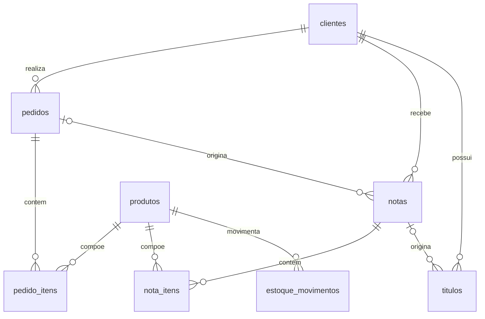

# Diagrama das tabelas

```mermaid
erDiagram
    clientes ||--o{ pedidos : realiza
    clientes ||--o{ notas : recebe
    clientes ||--o{ titulos : possui
    pedidos ||--o{ pedido_itens : contem
    pedidos o|--o{ notas : origina
    produtos ||--o{ pedido_itens : compoe
    notas ||--o{ nota_itens : contem
    produtos ||--o{ nota_itens : compoe
    notas o|--o{ titulos : origina
    produtos ||--o{ estoque_movimentos : movimenta
```

Chaves estrangeiras opcionais representam documentos sem vínculo, úteis para o diagnóstico. Os dados são fictícios.
